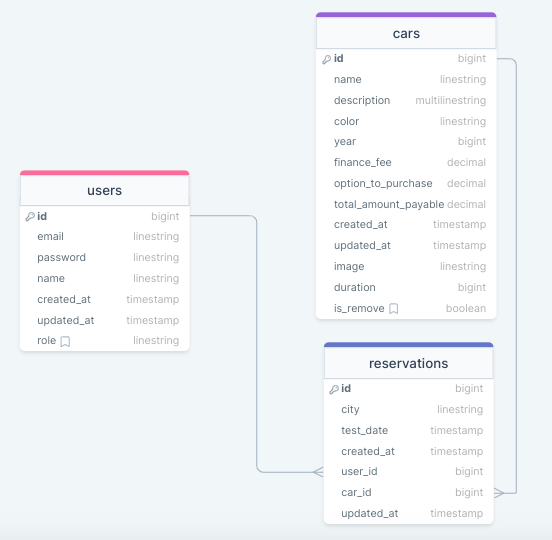
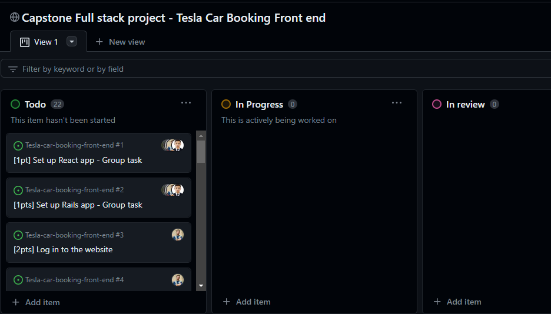

<a name="readme-top"></a>

<div align="center">

  <h2><b>Tesla Car Booking Backend</b></h2>
  <h4>Ivan Gonzalez & Bruno Kambere & Ali Baba & Hafiz Rasa & Steven Wafeek</h4>

</div>

<!-- TABLE OF CONTENTS -->

# 📗 Table of Contents

- [📖 About the Project](#about-project)
  - [🔗 Link to Frontend React app](#link-frontend)
  - [🛠 Built With](#built-with)
    - [Tech Stack](#tech-stack)
    - [Key Features](#key-features)
  - [📑 Database ERD](#erd)
    - [Kanban borad](#kanban-baord)
    - [🚀 Live Demo](#live-demo)
- [💻 Getting Started](#getting-started)
  - [Prerequisites](#prerequisites)
  - [Setup](#setup)
  - [Install](#install)
- [👥 Authors](#authors)
- [🔭 Future Features](#future-features)
- [🤝 Contributing](#contributing)
- [⭐️ Show your support](#support)
- [🙏 Acknowledgements](#acknowledgements)
- [📝 License](#license)

<!-- PROJECT DESCRIPTION -->

# 📖 Tesla Car Booking Frontend <a name="about-project"></a>

**Tesla Car Booking Frontend** is the back-end app that provides a user api for booking Tesla cars test drives. This app is integrated with the front end React app linked below.

## 💻 Link to front end React app <a name="link-frontend"></a>

The link to the React app:

- [React app link](https://github.com/ivangonzalez224/Tesla-car-booking-front-end)

## 🛠 Built With <a name="built-with"></a>

### Tech Stack <a name="tech-stack"></a>

<details>
  <summary>Stack</summary>
  <ul>
    <li><a href="https://rubyonrails.org/">Ruby on Rails</a></li>
  </ul>
</details>

<!-- Features -->

### Key Features <a name="key-features"></a>

- **Api endpoints**
- **Api endpoints documentation**
- **User Authorization && Authentication**

<p align="right">(<a href="#readme-top">back to top</a>)</p>

## 📑 Database ERD <a name="erd"></a>



<!-- Kanban board -->

## Kanban board <a name="kanban_board"></a>

Our project utilizes a Kanban board to visualize and manage tasks throughout the development process. The board is divided into several columns representing different stages of the workflow. Each task is represented by a card that can be moved between columns as it progresses.

### Columns:

- **To Do**: Tasks planned for the current or upcoming sprints.
- **In Progress**: Tasks that are actively being worked on.
- **Review**: Tasks that are completed and awaiting review.
- **Done**: Tasks that have been completed and implemented.

- [Kanban board link](https://github.com/users/ivangonzalez224/projects/9)

- Final Team Size: 5 members

- The initial state of Kanban board
  

<p align="right">(<a href="#readme-top">back to top</a>)</p>

## 🚀 Live Demo <a name="live-demo"></a>

 The link to the project deployed:

- [Live Demo api link](https://tesla-car-booking-q0hb.onrender.com)
- [Live Demo front end app link](https://tesla-car-booking-front.onrender.com)

<p align="right">(<a href="#readme-top">back to top</a>)</p>

<!-- GETTING STARTED -->

## 💻 Getting Started <a name="getting-started"></a>

In this project that used RoR to build a Tesla Car booking api.

### Prerequisites

In order to run this project you need:

1. Git.
2. Visual Studio Code or another code editor.
3. Browser.

### Setup

To get a local copy, follow these steps.

Clone this repository to your desired folder:

```sh
  cd my-folder
  git clone https://github.com/hafiz1379/Tesla-car-booking-back-end.git
```

### Install

This project does not require installation. Just clone the repository to your local machine.
Even though, for general purposes, Install this project with:

```sh
  cd my-folder
  bundle install
```

### Usage

To run the project, do the following:

1. Open your terminal
2. Navigate to your folder
3. Start the server (rails s)

```sh
   rails s
```

4. Open your browser at your local host

```sh
   http://localhost:3000
```

### Run tests

To run tests, run the following command:

```sh
  cd project
  rspec spec
```

### Create and set up the database

To run the backend app, run the following commands:

```sh
  cd project
  rails db:create
  rails db:migrate
  rails db:seed
```

<p align="right">(<a href="#readme-top">back to top</a>)</p>

<!-- AUTHORS -->

## 👥 Authors <a name="authors"></a>

👤 **Iván Gonzalez**

- GitHub: [@ivangonzalez224](https://github.com/ivangonzalez224)
- Twitter: [@Ivan Gonzalez](https://twitter.com/ivang2204)
- LinkedIn: [Iván Gonzalez Robles](https://www.linkedin.com/in/iván-gonzalez-robles-957491275/)

👤 **Ali Baba Hussaini**

- GitHub: [@Alibaba2023](https://github.com/Alibaba2023/)
- LinkedIn [Alibaba Hussaini](https://www.linkedin.com/in/ali-baba-hussaini-630607267/)

👤 **Hafizullah Rasa**

- GitHub: [Hafiz Rasa](https://github.com/hafiz1379)
- LinkedIn: [Hafiz Rasa](https://www.linkedin.com/in/hafiz1379/)

👤 **Bruno Kambere**

- GitHub: [@kambereBr](https://github.com/kambereBr)
- Twitter: [@kambereBr](https://twitter.com/kambereBr)
- LinkedIn: [bruno kambere](https://www.linkedin.com/in/bruno-kambere-399447138/)

👤 **steven wafeek**

- GitHub: [StevenWafeek](https://github.com/StevenWafeek)
- Twitter: [steven_hakeem](https://twitter.com/steven_hakeem)
- LinkedIn: [steven wafeek](https://www.linkedin.com/in/steven-wafeek-b629341b6/)

<p align="right">(<a href="#readme-top">back to top</a>)</p>

<!-- FUTURE FEATURES -->

## 🔭 Future Features <a name="future-features"></a>

- [ ] **Delete a user api endpoint**
- [ ] **Delete a reservation api endpoint**

<p align="right">(<a href="#readme-top">back to top</a>)</p>

<!-- CONTRIBUTING -->

## 🤝 Contributing <a name="contributing"></a>

Contributions, issues, and feature requests are welcome!

Feel free to check the [issues page](https://github.com/hafiz1379/Tesla-car-booking-back-end/issues).

<p align="right">(<a href="#readme-top">back to top</a>)</p>

<!-- SUPPORT -->

## ⭐️ Show your support <a name="support"></a>

If you like this project please leave a star!

<p align="right">(<a href="#readme-top">back to top</a>)</p>

<!-- ACKNOWLEDGEMENTS -->

## 🙏 Acknowledgments <a name="acknowledgements"></a>

I would like to thank Microverse.

<p align="right">(<a href="#readme-top">back to top</a>)</p>

<!-- LICENSE -->

## 📝 License <a name="license"></a>

This project is [MIT](./LICENSE) licensed.

<p align="right">(<a href="#readme-top">back to top</a>)</p>
